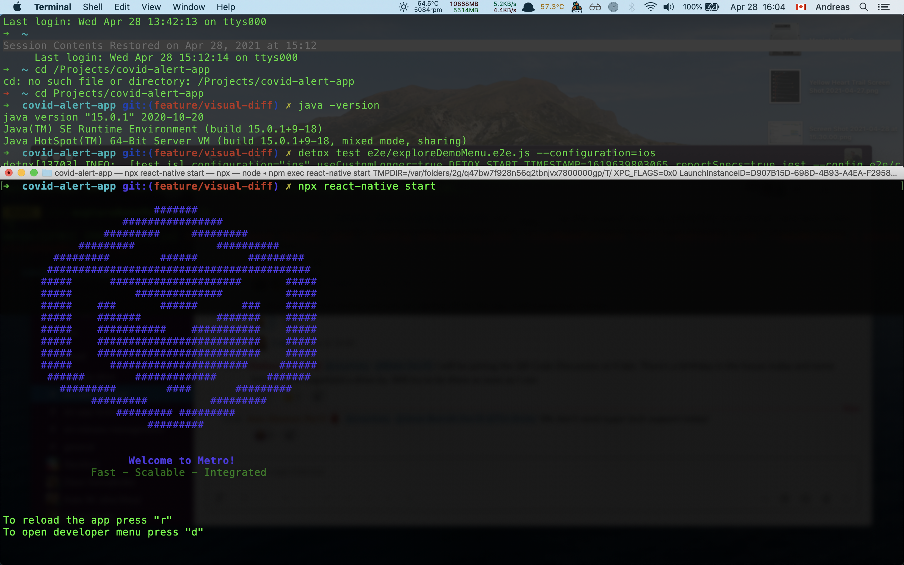
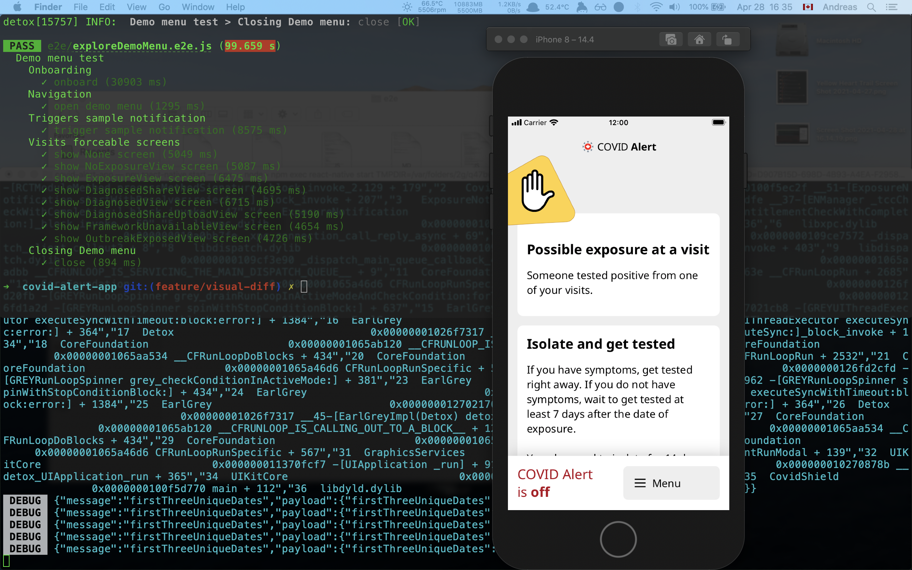

# End to end testing with Detox

## Environment Setup

It is reccomended these tests are run from a terminal prompt with unlimited lines of scroll-back.

Instructions for iTerm2: open Preferences -> open "Profiles" tab -> *your profile* -> open "Terminla" sub top-bar tab -> ✓ check "Unlimited Scrollback"

## iOS setup

1. Follow main repo install instructions
2. then, from a shell open in the repo run:

   `brew tap wix/brew && brew install applesimutils`
3. be sure the project builds in Xcode

## Android setup

1. Get yourself one or more emulators, you have options:

- [Detox recommends Android Open-Source Project (AOSP) emulators](https://github.com/wix/Detox/blob/master/docs/Introduction.AndroidDevEnv.md#android-aosp-emulators)
- Install from Android Studio [these instructions](https://github.com/wix/Detox/blob/master/docs/Introduction.AndroidDevEnv.md#installing-from-android-studio)

2.(Optional) [Set up quick boot](https://github.com/wix/Detox/blob/master/docs/Introduction.AndroidDevEnv.md#emulator-quick-boot) on the emulator.

**NOTE**: The AOSP emulators appear to require Java 8 (JDK 1.8). You may have a newer version of Java, like Java 15 installed...

**IMPORTANT JAVA NOTICE**

Read instructions on how to install older versions of Java alongside modern Java versions, and easily switch between them: [-> java.md <-](java.md)

## Tests

### Onboarding

A common tests to get through the onboarding. Often used before other test to get deeper into the app.

### ExploreDemoMenu

e2e testing Detox script that iterates through every page of the app available on the debug menu and takes screenshots as it goes.

See the `artifacts` folder for the output.

## Running Tests

### Preparation

`yarn pre:test:android`

or

`yarn pre:test:ios`

### Metro server

If you haven't recently run `yarn pre:test:ios`, or if you've run it, but closed the many prompts it opens, you might not have a metro server running. *Metro must be running* for Detox to interact with the app.

From a separate terminal tab, or prompt, navigate to the app repo and run `npx react-native start`



**BUNDLE BUILDING TAKES TIME**
-> progress bar on bottom of Metro server window for progress.

### Individual tests

*As outilned in `.detoxrc.json`*

From a command prompt, navigate to the main repo directory, and for example, run:

`detox test e2e/exploreDemoMenu.e2e.js --configuration=ios`

or use `--configuration=android.aosp` to test with the android AOSP simulator.

A succesful run of this test will look like this:


This test ran in 100 seconds on a 2017, 13-inch Macbook Pro laptop.

### Running the entire test suite

This may take several minutes, and heavily uses computer resources while running.

Executing either

 `yarn test:android`

or

`yarn test:ios`

from the root fo the project will execute all `.e2e.js` tests containted in the `/e2e` folder. They are all run in parallel by Jest, and thus order of execution is not guaranteed.

## TROUBLESHOOTING

Sorted by "deeper into the rabbit hole":

### Simulator Errors/Warnings

You can dismiss these warnings, and they should go away for the lifetime of the simulator.

*IMPORTANT*

When Errors pop up, they will overlay ontop the app the simulator is trying to show, and thus block Detox from interacting with items below the warnings/errors.

This is a common fault from exposure-checks failing at the start of Onboarding because the automated test can't click through the onboarding carousel...

If your issues persist, please file an [Issue on Github](https://github.com/cds-snc/covid-alert-app/issues) to see if the error(s) can be remedied or handled differently.

### (iOS) Detox builds fail unexpectedly

Many things can cause builds to fail. Basically, the app must succesfully build in Xcode, deploy to and open the simulator in Xcode (or with `yarn run-ios`), otherwise Detox builds won't work... but here are some things to try:

1. Open the app project in Xcode
2. (optional) NavBar -> Product -> Clean Build Folder (accept to kill any running instances)
3. navigate throught Left Sidebar -> Folder Icon -> click on "CovidShield" project -> opens -> middle top tab "Signing & Capabilities" -> middle lower top tab "Debug" -> collapsible section "Signing" -> dropdown "Provisionning Profile" -> make sure no errors here...
4. Top bar -> ensure Active Scheme set to "Staging"
5. Top bar -> ensure Target Device set to preferred simulator (iPhone 8 reccomended)

### (iOS) Detox builds fail with specific message

***xcodebuild: error: The workspace named "CovidShield" does not contain a scheme named "SchemeName".***

The Xcode build schema was changed and needs to be updated in `.detoxrc.json`.

### (Android) Detox builds fail unexpectedly

1. Open the app project in Android Studio
2. You likely have updates pending, apply them all.
3. Top bar -> Build project

Project must succesfully build in Android Studio, otherwise it'll never work on the command-line...

### Tests Failing

#### Randomly

just run the test once more... this is pretty common.

#### with Specific Messages

***Test Failed: No views in hierarchy found matching: (with tag value: is "someTagName"***

this means one test item is looking for an HTML-like item with a tag/attribute of the name "someTagName", and is not finding it. Most likely a swipe/scroll handle not set (by the devs) in a newly made "SomethingView.tsx".

### (Android) In the case of

```bash
> Task :@react-native-community_async-storage:processDebugAndroidTestResources FAILED
```

you can try: `cd android && ./gradlew clean`
